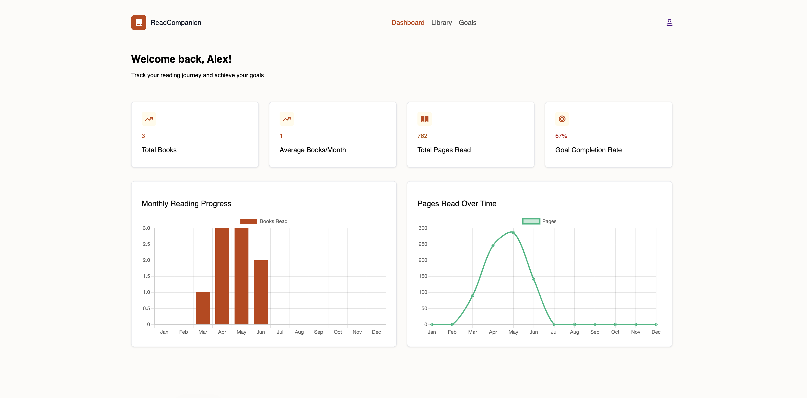
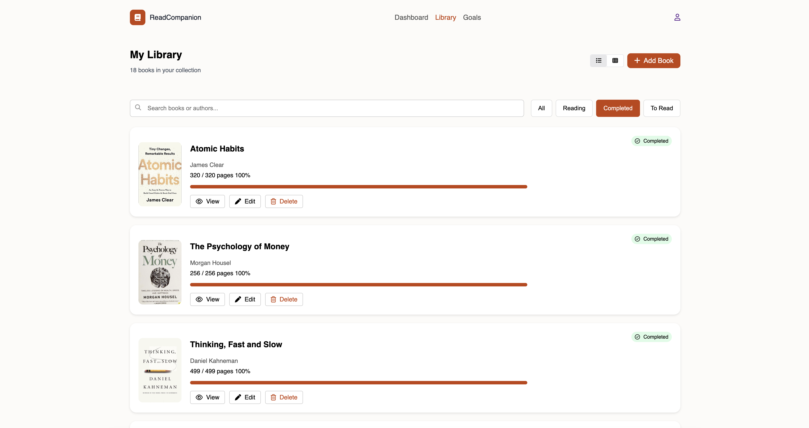

# Smart Reading Companion

[](https://flask.palletsprojects.com/)
[](https://www.python.org/)
[](https://jinja.palletsprojects.com/)

Smart Reading Companion is a Flask-based reading tracker that helps users manage their library, monitor reading progress, and review personal reading insights from a dashboard.

## Overview

The application provides a focused workflow for readers who want to:

- organize books in a personal library
- track page-by-page progress
- log reading sessions automatically
- set and manage reading goals
- review reading statistics and trends

## Key Features

- Secure sign-up, sign-in, and logout
- Book library with add, edit, delete, and search support
- Book detail pages with progress updates and session history
- Goal tracking for daily, weekly, monthly, and annual targets
- Dashboard analytics for total books, pages read, completion rate, and monthly activity
- Persistent browser preferences for library view and filtering

## Tech Stack

- Python
- Flask
- Jinja templates
- JavaScript
- HTML and CSS
- JSON file storage

## Requirements

- Python 3.9+
- Flask

## Setup

Create a virtual environment and install Flask:

```bash
python3 -m venv .venv
source .venv/bin/activate
pip install Flask
```

## Run

Start the application from the project root:

```bash
python app.py
```

Then open:

```text
http://127.0.0.1:5000
```

## Data Storage

All app data is stored in [`users.json`](./users.json), including:

- user profiles
- password hashes
- books and reading progress
- reading sessions
- goals

## Project Layout

```text
.
├── app.py
├── models/
├── routes/
├── static/
├── templates/
├── utils/
└── users.json
```


## Screenshots

Add app screenshots here to showcase the main experience.

| Dashboard | Library |
| --- | --- |
|  |  |


## Demo Video

Add a short Loom walkthrough here if you want a quick product demo:

```text
https://www.loom.com/share/397bd1fbd5b74919904a47107270e23f
```
